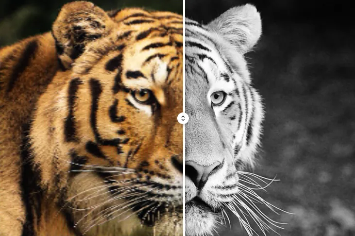

# AI Image Colorizer
Colorize old photos instantly with AI. Colorize black and white photos online for free with AI. Colorize black-and-white photos online in seconds

**Colorize old black-and-white photos directly in your browser. No servers, no sign-up, 100% private.**

## 🚀 Live Demo

Try the tool right now: **[E[nlace a tu página web](https://online-tools.muisca.co/en/tools/generators/colorize-black-white-photos)]**

## Key Features

- **🔒 Total Privacy**: All processing takes place locally in your browser. Your images are **never** sent to any external server.
- **⚡ No Installation Required**: Runs entirely in the browser using JavaScript, HTML, and CSS. No downloads or complex configurations needed.
- **🧠 Powerful AI**: Uses **DeOldify**, a leading open-source deep learning neural network for photo colorization and restoration.
- **📦 Local Execution with ONNX**: The AI ​​model runs via **ONNX Runtime** directly on your device, ensuring speed and security.
- **💯 Free and Ad-Free**: A completely free tool—no ads, no trackers, and no registration required.
- **📱 Multi-platform**: Compatible with any modern browser (Chrome, Firefox, Edge, Safari) on desktop and mobile.

## 🛠️ How It Works

1. **Upload your image**: Drag and drop or select a black-and-white photo (JPG, PNG, WEBP).
2. **Local processing**: The DeOldify neural network runs in your browser using ONNX Runtime.
3. **Download the result**: Get your high-quality colorized image, ready to save.

>⚠️ **Note**: The first use may take a few seconds while the AI ​​model loads in your browser. Subsequent uses will be much faster.

## 📂 Project Structure

This project is designed to be as simple as possible:

All the code is contained in a **single HTML file** to facilitate deployment and usage.

## 🧪 Technical Requirements

- Modern browser with support for WebAssembly and ONNX Runtime
- Internet connection required only for the initial load (model download)
- Device with at least 4GB of RAM recommended for optimal performance

## 🤝 Contributions

Contributions are welcome. If you wish to improve the tool:

1. Fork the repository
2. Create a feature branch (`git checkout -b feature/AmazingFeature`)
3. Commit your changes (`git commit -m 'Add some AmazingFeature'`)
4. Push to the branch (`git push origin feature/AmazingFeature`)
5. Open a Pull Request

## 📄 License

This project is licensed under the MIT License. 

## 🙏 Acknowledgments

- **[DeOldify](https://github.com/jantic/DeOldify)**: For providing the open-source AI model for image colorization.
- **[ONNX Runtime](https://onnxruntime.ai/)**: For enabling efficient machine learning model execution in the browser.
- **Open Source Community**: For making accessible and privacy-focused tools possible for everyone.

---

**Made with ❤️ to preserve memories using modern, privacy-respecting technology.**

